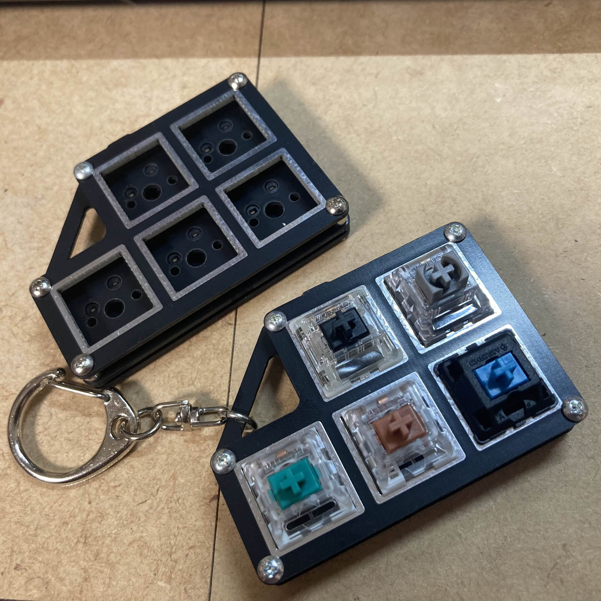

# Keyswich Tester Keyholder

スイッチテスター・キーホルダー(3u/5u)

# Build Guide
## 必要な部品
※販路やイベントにより同梱品が異なります
- 基板とプレート
  星と文字の描かれているものがバックパネル、スイッチソケットの表示があるものが基板、四角い穴があるものがスイッチプレートです。
  バックパネルは星のある面が外側、スイッチプレートはメッキ面が平らで綺麗な方が外側です。
- スペーサー  
  想定しているものは全ねじM2 3.5mmとM2 2mmを5本ずつ使用することです  
- ネジ  
  上記のスペーサーに対応するのはM2x7、M2x3を5本ずつです
- 対応するキーソケット  
  3個または5個
## 必要な工具
- はんだ作業用品
- ドライバー
- やすり  
  ※必要ないかもしれません
- 油性ペン(黒)

## 組み立て方
### 1.基板を手入れする
  基板の端には割った跡があります。ガサガサになっている場合はヤスリで磨きます。  
  端を油性ペンで塗ると綺麗に見えます。
### 2.キーソケットをはんだづけする
  部品を実装する基板に、基板の表示に合わせてキーソケットをはめ、はんだ付けします。
### 3.組み立てる
  使用するネジの長さと種類により組み立て方が変わります。
  - (推奨・高価)7mmと3mmのネジを使用する場合  
    この場合、バックパネルの、星のある面から7mmのネジを通します。
    マスキングテープでネジを仮止めし、ネジが上向くようにしたら、2mmのスペーサーを入れ、基板を重ねて3.5mmのスペーサーで固定します。
    この状態でスイッチプレートを重ね、3mmのネジで固定します。  
  - (推奨・安価)12mmのネジとナットを使用する場合
    スイッチプレートの表からネジを通したら、3.5mmスペーサー、基板、2mmスペーサー、バックパネルの順に重ねます。
    最後にナットでしっかり固定します。
  - (非推奨)6mmと3mmのネジを使用する場合
    バックパネルの、星のある面から6mmのネジを通したら、スペーサーを入れずに基板を重ね、3.5mmのネジ付きスペーサーで固定します。
    このままスイッチプレートを重ね、3mmのネジで固定します。
  
  これで、スイッチテスターは完成です！  
  三角形の穴には好みのキーチェーンやパラコードなどを通してネックレスやキーホルダーにしましょう！  
  ※強く引っ張ると基板の破損の原因になるためご注意ください

## 組み立て済み販売のバラし方
イベント等で組み立て済みの状態で販売している際、部品の在庫状況によって使用するパーツや組み立て手順が変わってくる場合があります。  
基本的には以下の3種類のどれかになりますので、それぞれ確認してからバラしてください。  
なお、ネジに使用している緩み止め剤は取り外し可能タイプですが、場合により非常に硬く固着してしまう場合があります。  
衝撃を与える、加熱するなどの手段で解除できる場合がありますが、不安な場合はサポートを行いますので、連絡してください。

### 裏表両方がネジ止め、かつ、スペーサーが六角形の場合
裏表両方がネジ止めされている場合、裏からは長いネジ、表からは短いネジで固定しています。  
表側のネジを抜き、スイッチプレートを外したら、スペーサーを外します。  
このとき、ドライバーを裏から当て、基板を固定した状態で、ソケットレンチなどを利用してスペーサーのみを回してください[^1]。  
スペーサーをすべて抜くと基板が外せるようになり、さらに下のスペーサーを外すことによりバックプレートも外れます。  
組み立て時はこの手順を逆にたどることにより安全に組み立てが可能です。

[^1]: 両方のスペーサーがネジ付きのため、ドライバーを回しても下側のスペーサーが追従して回しづらいです。無理に回すとネジが舐める原因になります。

### 裏表両方がネジ止め、かつ、スペーサーが丸形の場合
スペーサーと同様のネジで固定していますが、下側のスペーサーはネジなしとなっています。  
表裏どちらのネジを回しても全てのスペーサーを解除できますが、ネジが緩んでいるとスペーサーとネジごと回って外れないことがあります。  
この場合は上側のスペーサーを指で押さえながらネジを回すことで外すことができます。  
組み立て時は、バックプレートに長いネジをさし、硬い板を載せてひっくり返すことでネジを上向きに露出させます。  
この状態で、短いスペーサー、基板を重ね、長いスペーサーをネジに固定していきます。  
全てのスペーサーを固定したら、スイッチプレートを載せ、短いネジで固定してください。  
※この組み合わせの場合、非常に外しづらくなってしまう可能性があるため、緩み止め剤は施していません

### 裏側がナット止めの場合
裏からナットで固定されている場合、長いネジを1本通すことで固定しています。  
ネジを回してナットを外すと、ネジを抜いた時にすべてのスペーサーが落ちるため、注意してください。  
組み立て時は、スイッチプレートにネジをさしてから硬い板を載せてひっくり返したり、マスキングテープで仮止めすることでネジを裏側から上向きに露出させます。  
この状態で、長いスペーサー、基板、短いスペーサー、バックプレートを重ね、最後に全てのナットを仮止めしたら、ドライバーとソケットレンチ等を使用してしっかり固定してください。
